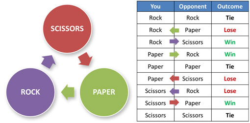

# The "Rock - Paper - Scissors" Game
This is a simple console game "Rock Paper Sccissors".

"Rock paper scissors" is a well know game where 2 players choose between rock, paper or scissors.
Here is a table with the possible moves:

I've use simple console reading methods to take the move form the player and a random move from the computer with the (Random) class in Java.
The move goes through some "if" checks and then on the console appears if you win, lose or you both have selescted the same move and the game goes to draw.